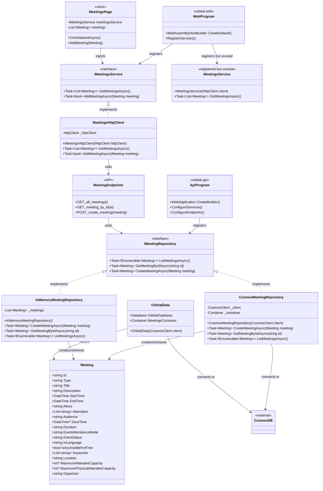

# Meeting Repository Architecture

This document provides a visual representation of the Meeting Repository architecture and related components in the Orbital codebase.

## Summary

The implementation follows a clean layered architecture:

1. The client (`MeetingsHttpClient`) implements the service interface (`IMeetingsService`)
2. The client calls the API endpoints (defined in `orbital.api`)
3. The API endpoints utilize the repository interface (`IMeetingRepository`)
4. The repository implementation (`CosmosMeetingRepository`) interacts with the data store (Cosmos DB)

This pattern maintains separation of concerns and allows for independent testing and development of each layer.

## Class Diagram

The diagram below illustrates the relationship between the Meeting Repository, its implementations, client components, and how they interact with other components in the system.

## Flow Description

1. The `Meeting` class is the core domain model representing meeting data with various properties following Schema.org standards.

2. **Server-Side Components:**
   - The `IMeetingRepository` interface defines the contract for accessing meeting data with three main operations:
     - Listing all meetings
     - Getting a specific meeting by ID
     - Creating a new meeting
   - Two implementations of the repository pattern are provided:
     - `CosmosMeetingRepository`: Production implementation that connects to Azure Cosmos DB
     - `InMemoryMeetingRepository`: Testing implementation that stores meetings in memory
   - The API exposes three endpoints for meeting operations that delegate to the repository:
     - GET /api/meetings - Lists all meetings
     - GET /api/meetings/{id} - Gets a specific meeting
     - POST /api/meetings - Creates a new meeting

3. **Client-Side Components:**
   - The `IMeetingsService` interface defines the contract for the web client to interact with the API
   - `MeetingsHttpClient` implements this interface, making HTTP requests to the API endpoints
   - `MeetingsService` is registered in the DI container but not currently used in the application
   - The `MeetingsPage` Razor component consumes the `IMeetingsService` to display and manage meetings

4. **Configuration:**
   - The `ApiProgram` (in orbital.api) configures the server-side services and endpoints
   - The `WebProgram` (in orbital.web) configures the client-side services and HTTP clients
   - Both programs register their respective implementations of the meeting repositories/services

5. The `OrbitalData` class provides direct access to the Cosmos DB containers, including the meetings container.

## Repository Design Benefits

This implementation follows the Repository Pattern, which provides several benefits:

1. **Abstraction**: The business logic works with the interface, not the concrete implementation
2. **Testability**: The InMemoryMeetingRepository allows for easy unit testing without database dependencies
3. **Separation of concerns**: Data access logic is isolated from business logic
4. **Flexibility**: The system can easily switch between different data storage mechanisms

## Client-Service Architecture Benefits

The client-side implementation in the web project follows a Service Pattern, which offers:

1. **Decoupling**: The UI components don't know how the data is fetched, only that they can request it
2. **Reusability**: Services can be injected into multiple components
3. **Testability**: Mock implementations can be provided for testing
4. **Maintainability**: Changes to the API interaction logic are isolated to the service implementations
