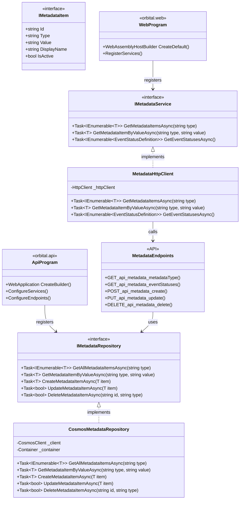

# Metadata API Implementation Recommendation

To align the Metadata implementation with the Meeting implementation pattern, the API endpoints should use the `IMetadataRepository` directly instead of using an `IMetadataService` in the API layer.

## Current Architecture (Inconsistent)

- **Meeting API**: Endpoints → `IMeetingRepository` → Data
- **Metadata API**: Endpoints → `IMetadataService` → `IMetadataRepository` → Data

## Recommended Architecture (Consistent)

- **Meeting API**: Endpoints → `IMeetingRepository` → Data
- **Metadata API**: Endpoints → `IMetadataRepository` → Data

## Specific Code Changes Required

### 1. Update `MetadataEndpoints.cs`

Change all endpoints to use `IMetadataRepository` instead of `IMetadataService`:

```csharp
// Get event statuses
group.MapGet("/eventStatuses", async (IMetadataRepository repository) =>
{
    var items = await repository.GetAllMetadataItemsAsync<EventStatusDefinition>("eventStatus");
    return Results.Ok(items);
})
.WithName("GetEventStatuses")
.WithOpenApi()
.Produces<IEnumerable<EventStatusDefinition>>(StatusCodes.Status200OK);

// Generic endpoint for any metadata type
group.MapGet("/{metadataType}", async (string metadataType, IMetadataRepository repository) =>
{
    var items = await repository.GetAllMetadataItemsAsync<MetadataDefinition>(metadataType);
    return Results.Ok(items);
})
.WithName("GetMetadataByType")
.WithOpenApi()
.Produces<IEnumerable<MetadataDefinition>>(StatusCodes.Status200OK);

// Create metadata item
adminGroup.MapPost("/", async (MetadataDefinition item, IMetadataRepository repository) =>
{
    if (string.IsNullOrEmpty(item.Type) || string.IsNullOrEmpty(item.Value))
    {
        return Results.BadRequest("Type and Value are required");
    }

    var result = await repository.CreateMetadataItemAsync(item);
    return Results.Created($"/api/metadata/{item.Type}/{result.Id}", result);
})
.WithName("CreateMetadataItem");

// Update metadata item
adminGroup.MapPut("/", async (MetadataDefinition item, IMetadataRepository repository) =>
{
    if (string.IsNullOrEmpty(item.Id) || string.IsNullOrEmpty(item.Type))
    {
        return Results.BadRequest("Id and Type are required");
    }

    var success = await repository.UpdateMetadataItemAsync(item);
    if (!success)
    {
        return Results.NotFound();
    }

    return Results.NoContent();
})
.WithName("UpdateMetadataItem");

// Delete metadata item
adminGroup.MapDelete("/{metadataType}/{id}", async (string metadataType, string id, IMetadataRepository repository) =>
{
    var success = await repository.DeleteMetadataItemAsync<MetadataDefinition>(id, metadataType);
    if (!success)
    {
        return Results.NotFound();
    }

    return Results.NoContent();
})
.WithName("DeleteMetadataItem");
```

### 2. Update `Program.cs` Registration

Register the `IMetadataRepository` in `Program.cs` (similar to how `IMeetingRepository` is registered):

```csharp
// Existing Meeting repository registration
builder.Services.AddScoped<IMeetingRepository, CosmosMeetingRepository>();

// Add Metadata repository registration
builder.Services.AddScoped<IMetadataRepository, CosmosMetadataRepository>();

// Remove IMetadataService registration if it exists
```

### 3. Client-Side IMetadataService

Move the `IMetadataService` implementation entirely to the client side (orbital.web project) following the same pattern as the Meetings implementation:

```csharp
// In orbital.web project
public interface IMetadataService
{
    Task<IEnumerable<T>> GetMetadataItemsAsync<T>(string metadataType) where T : IMetadataItem;
    Task<T?> GetMetadataItemByValueAsync<T>(string metadataType, string value) where T : IMetadataItem;
    Task<IEnumerable<EventStatusDefinition>> GetEventStatusesAsync();
    // Any other methods needed by the client
}

public class MetadataHttpClient : IMetadataService
{
    private readonly HttpClient _httpClient;

    public MetadataHttpClient(HttpClient httpClient)
    {
        _httpClient = httpClient ?? throw new ArgumentNullException(nameof(httpClient));
    }

    public async Task<IEnumerable<T>> GetMetadataItemsAsync<T>(string metadataType) where T : IMetadataItem
    {
        var response = await _httpClient.GetAsync($"/api/metadata/{metadataType}");
        if (response.IsSuccessStatusCode)
        {
            var items = await response.Content.ReadFromJsonAsync<IEnumerable<T>>();
            return items ?? Enumerable.Empty<T>();
        }
        
        throw new Exception($"Failed to load {metadataType} metadata");
    }

    public async Task<T?> GetMetadataItemByValueAsync<T>(string metadataType, string value) where T : IMetadataItem
    {
        var items = await GetMetadataItemsAsync<T>(metadataType);
        return items.FirstOrDefault(i => i.Value == value);
    }

    public async Task<IEnumerable<EventStatusDefinition>> GetEventStatusesAsync()
    {
        var response = await _httpClient.GetAsync("/api/metadata/eventStatuses");
        if (response.IsSuccessStatusCode)
        {
            var items = await response.Content.ReadFromJsonAsync<IEnumerable<EventStatusDefinition>>();
            return items ?? Enumerable.Empty<EventStatusDefinition>();
        }
        
        throw new Exception("Failed to load event status metadata");
    }
}
```

## Caching Considerations

If caching is still required at the API level, consider two options:

1. Add a caching decorator for `IMetadataRepository` in the API (transparent to the endpoints)
2. Use the built-in ASP.NET Core response caching middleware instead of custom caching

Either approach keeps the architecture pattern consistent while still providing performance benefits.

## Benefits of This Change

1. **Consistency**: Both Meeting and Metadata follow the same pattern
2. **Simplicity**: Removes an unnecessary layer in the API
3. **Maintainability**: Easier to understand with a consistent approach
4. **Performance**: Can still implement caching, but in a consistent way

## Updated Architecture Diagram


