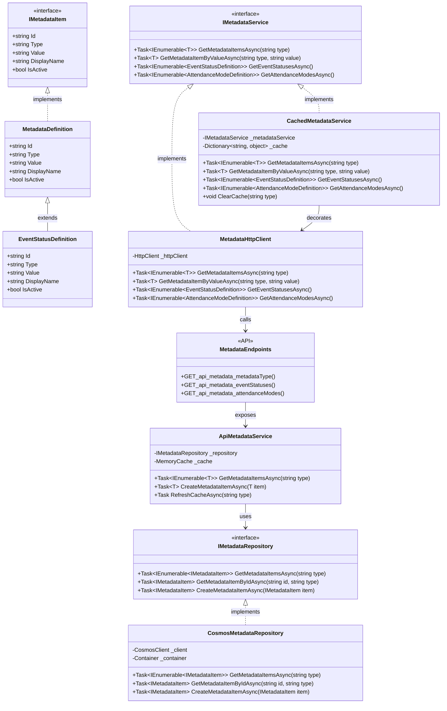

# Metadata Implementation Alignment

Based on the successful Meeting repository pattern, here's a proposed refactoring of the Metadata implementation to better align with the established pattern in the codebase.

## Current Architecture Comparison

### Meeting Implementation (Working Well)
- Clean layered architecture
- Simple interface (`IMeetingsService`) with focused methods
- Clear implementation (`MeetingsHttpClient`) that handles HTTP calls
- Direct registration in DI container
- Razor components inject the interface

### Metadata Implementation (More Complex)
- More complex client implementation with caching
- Additional validation methods
- Mixed responsibilities in the client

## Proposed Changes

To align the Metadata implementation with the Meeting pattern:

### 1. Create a Simple Interface for Metadata Service

```csharp
public interface IMetadataService
{
    Task<IEnumerable<T>> GetMetadataItemsAsync<T>(string metadataType) where T : IMetadataItem;
    Task<T?> GetMetadataItemByValueAsync<T>(string metadataType, string value) where T : IMetadataItem;
    // Specific convenience methods
    Task<IEnumerable<EventStatusDefinition>> GetEventStatusesAsync();
    Task<IEnumerable<AttendanceModeDefinition>> GetAttendanceModesAsync();
}
```

### 2. Implement a Clean HTTP Client

```csharp
public class MetadataHttpClient : IMetadataService
{
    private readonly HttpClient _httpClient;

    public MetadataHttpClient(HttpClient httpClient)
    {
        _httpClient = httpClient ?? throw new ArgumentNullException(nameof(httpClient));
    }

    public async Task<IEnumerable<T>> GetMetadataItemsAsync<T>(string metadataType) where T : IMetadataItem
    {
        string endpoint = metadataType.EndsWith("s") ? metadataType : $"{metadataType}s";
        var response = await _httpClient.GetAsync($"/api/metadata/{endpoint}");
        
        if (response.IsSuccessStatusCode)
        {
            var items = await response.Content.ReadFromJsonAsync<IEnumerable<T>>();
            return items ?? Enumerable.Empty<T>();
        }
        
        throw new Exception($"Failed to load {metadataType} metadata");
    }

    public async Task<T?> GetMetadataItemByValueAsync<T>(string metadataType, string value) where T : IMetadataItem
    {
        var items = await GetMetadataItemsAsync<T>(metadataType);
        return items.FirstOrDefault(i => i.Value == value);
    }

    public async Task<IEnumerable<EventStatusDefinition>> GetEventStatusesAsync() => 
        await GetMetadataItemsAsync<EventStatusDefinition>("eventStatus");
        
    public async Task<IEnumerable<AttendanceModeDefinition>> GetAttendanceModesAsync() => 
        await GetMetadataItemsAsync<AttendanceModeDefinition>("attendanceMode");
}
```

### 3. If Caching is Required, Create a Separate Decorator

```csharp
public class CachedMetadataService : IMetadataService
{
    private readonly IMetadataService _metadataService;
    private readonly Dictionary<string, object> _cache = new();
    private readonly SemaphoreSlim _cacheLock = new SemaphoreSlim(1, 1);

    public CachedMetadataService(IMetadataService metadataService)
    {
        _metadataService = metadataService;
    }

    public async Task<IEnumerable<T>> GetMetadataItemsAsync<T>(string metadataType) where T : IMetadataItem
    {
        string cacheKey = $"{metadataType}_{typeof(T).Name}";
        
        // Check cache first
        if (_cache.TryGetValue(cacheKey, out var cachedItems))
        {
            return (IEnumerable<T>)cachedItems;
        }
        
        // If not in cache, get from service and cache it
        await _cacheLock.WaitAsync();
        try
        {
            // Double-check pattern
            if (_cache.TryGetValue(cacheKey, out cachedItems))
            {
                return (IEnumerable<T>)cachedItems;
            }
            
            var items = await _metadataService.GetMetadataItemsAsync<T>(metadataType);
            var itemsList = items.ToList();
            _cache[cacheKey] = itemsList;
            return itemsList;
        }
        finally
        {
            _cacheLock.Release();
        }
    }

    public async Task<T?> GetMetadataItemByValueAsync<T>(string metadataType, string value) where T : IMetadataItem
    {
        var items = await GetMetadataItemsAsync<T>(metadataType);
        return items.FirstOrDefault(i => i.Value == value);
    }

    public async Task<IEnumerable<EventStatusDefinition>> GetEventStatusesAsync() => 
        await GetMetadataItemsAsync<EventStatusDefinition>("eventStatus");
        
    public async Task<IEnumerable<AttendanceModeDefinition>> GetAttendanceModesAsync() => 
        await GetMetadataItemsAsync<AttendanceModeDefinition>("attendanceMode");
        
    public void ClearCache(string metadataType = null)
    {
        if (metadataType == null)
        {
            _cache.Clear();
        }
        else
        {
            var keysToRemove = _cache.Keys
                .Where(k => k.StartsWith($"{metadataType}_"))
                .ToList();
                
            foreach (var key in keysToRemove)
            {
                _cache.Remove(key);
            }
        }
    }
}
```

### 4. Updated Registration in Program.cs

```csharp
// Register the HTTP client
builder.Services.AddHttpClient<IMetadataService, MetadataHttpClient>(client =>
{
    client.BaseAddress = new Uri(baseApiUrl);
});

// Optionally wrap with caching if needed
builder.Services.Decorate<IMetadataService, CachedMetadataService>();
```

## Diagram of the Aligned Architecture



## Benefits of the Aligned Architecture

1. **Consistent Patterns**: Both Meeting and Metadata implementations would follow the same patterns, making the codebase more maintainable.

2. **Separation of Concerns**: 
   - `MetadataHttpClient`: Only responsible for HTTP communication
   - `CachedMetadataService`: Only responsible for caching logic
   - Components only need to work with the `IMetadataService` interface

3. **Flexibility**: The decorator pattern allows for optional caching without complicating the base implementation.

4. **Testability**: Each component can be tested in isolation, with clear responsibilities.

5. **Scalability**: As requirements grow, the architecture can accommodate extensions while maintaining the same pattern.

## Implementation Steps

1. Create the `IMetadataService` interface
2. Implement the basic `MetadataHttpClient`
3. If needed, implement the `CachedMetadataService` decorator
4. Update the Program.cs registration
5. Update any components that currently use the existing metadata client

This approach will align the Metadata implementation with the successful Meeting pattern while maintaining all the functionality needed for Metadata operations.
