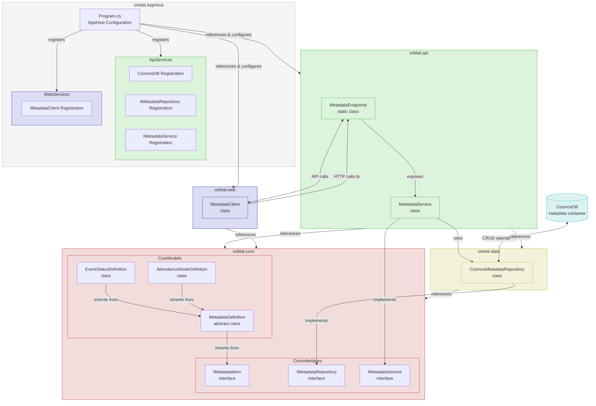

# Metadata System Architecture

Below is a comprehensive visualization of the components in the metadata system within the .NET Aspire application architecture:



## .NET Aspire Architecture Explanation

Let me explain how this structure works specifically within your .NET Aspire application:

### 1. Project Structure

- **orbital.core**: Contains all interfaces and domain models
  - Defines the contract through interfaces (`IMetadataItem`, `IMetadataRepository`, `IMetadataService`)
  - Contains the domain models (`MetadataDefinition`, `EventStatusDefinition`, etc.)

- **orbital.data**: Implements data access logic
  - Contains `CosmosMetadataRepository` which accesses Cosmos DB
  - Implements the `IMetadataRepository` interface from orbital.core

- **orbital.api**: Exposes metadata through REST endpoints
  - Contains minimal API endpoints (`MetadataEndpoints`)
  - Has its own implementation of `MetadataService` for caching

- **orbital.web**: Frontend project that consumes the API
  - Contains `MetadataClient` for HTTP communication with the API
  - Client-side caching can be implemented within this client

- **orbital.AppHost**: .NET Aspire orchestration project
  - Configures and connects all services
  - Manages dependencies and service discovery

### 2. Component Interaction

1. **Data Flow**:
   - `CosmosMetadataRepository` reads/writes to Cosmos DB
   - `MetadataService` in the API caches data from the repository
   - API endpoints expose this data via HTTP
   - `MetadataClient` in the web project calls these endpoints and can implement its own caching

2. **Dependency Injection**:
   - In the API project: Register `CosmosMetadataRepository` → `MetadataService`
   - In the web project: Register `MetadataClient` only

3. **.NET Aspire Configuration**:
   - `orbital.AppHost` registers and configures the Cosmos DB connection
   - Manages distributed application resources
   - Handles service discovery between projects

### 3. Aspire Specific Considerations

Since you're using .NET Aspire, there are a few specific architectural benefits:

1. **Service Discovery**: Aspire handles service URLs and connectivity between components
2. **Configuration Management**: Centralized in the AppHost project
3. **Resilience Policies**: Can be applied to HTTP clients and Cosmos DB connections
4. **Observability**: Built-in telemetry for all components

### 4. Key Benefits of this Architecture

1. **Clear Separation of Concerns**: 
   - API is the single source of truth for metadata
   - Web client is a consumer with its own caching strategy
   - No duplication of data access logic

2. **Performance Optimization**:
   - Primary caching happens at the API level
   - Optional secondary caching in the client reduces API calls
   - HTTP caching headers can be utilized for even better performance

3. **Simplified Maintenance**:
   - Only one implementation of `MetadataService` to maintain
   - Changes to metadata handling only need to be made in one place
   - Client only needs to know about the API contract, not the data storage

4. **Consistent Access Pattern**:
   - All data (meetings, metadata, etc.) flows through the API
   - Uniform approach to data access across the application
   - Easier to secure, monitor, and manage

5. **Scalability**:
   - Fits well with Aspire's distributed application model
   - API can be scaled independently of the web application
   - Cosmos DB connection is managed in a single location

## MetadataClient Implementation

In the web project, the `MetadataClient` should be implemented to efficiently retrieve metadata from the API and handle any client-side caching:

```csharp
public interface IMetadataClient
{
    Task<IEnumerable<EventStatusDefinition>> GetEventStatusesAsync();
    Task<IEnumerable<AttendanceModeDefinition>> GetAttendanceModesAsync();
    Task<IEnumerable<T>> GetMetadataItemsAsync<T>(string metadataType) where T : IMetadataItem;
    Task<T?> GetMetadataItemByValueAsync<T>(string metadataType, string value) where T : IMetadataItem;
    bool IsValidMetadataValue(string metadataType, string value);
    
    // Force refresh local cache
    void ClearCache(string metadataType = null);
}

public class MetadataClient : IMetadataClient
{
    private readonly HttpClient _httpClient;
    private readonly Dictionary<string, object> _cache = new();
    private readonly SemaphoreSlim _cacheLock = new SemaphoreSlim(1, 1);
    
    public MetadataClient(HttpClient httpClient)
    {
        _httpClient = httpClient;
    }
    
    public async Task<IEnumerable<T>> GetMetadataItemsAsync<T>(string metadataType) where T : IMetadataItem
    {
        string cacheKey = $"{metadataType}_{typeof(T).Name}";
        
        // Check cache first
        if (_cache.TryGetValue(cacheKey, out var cachedItems))
        {
            return (IEnumerable<T>)cachedItems;
        }
        
        // If not in cache, get from API and cache it
        await _cacheLock.WaitAsync();
        try
        {
            // Double-check pattern
            if (_cache.TryGetValue(cacheKey, out cachedItems))
            {
                return (IEnumerable<T>)cachedItems;
            }
            
            string endpoint = metadataType.EndsWith("s") ? metadataType : $"{metadataType}s";
            var response = await _httpClient.GetAsync($"/api/metadata/{endpoint}");
            
            if (response.IsSuccessStatusCode)
            {
                var items = await response.Content.ReadFromJsonAsync<IEnumerable<T>>();
                var itemsList = items?.ToList() ?? new List<T>();
                _cache[cacheKey] = itemsList;
                return itemsList;
            }
            
            throw new Exception($"Failed to load {metadataType} metadata");
        }
        finally
        {
            _cacheLock.Release();
        }
    }
    
    public async Task<IEnumerable<EventStatusDefinition>> GetEventStatusesAsync() => 
        await GetMetadataItemsAsync<EventStatusDefinition>("eventStatus");
        
    public async Task<IEnumerable<AttendanceModeDefinition>> GetAttendanceModesAsync() => 
        await GetMetadataItemsAsync<AttendanceModeDefinition>("attendanceMode");
    
    public async Task<T?> GetMetadataItemByValueAsync<T>(string metadataType, string value) where T : IMetadataItem
    {
        var items = await GetMetadataItemsAsync<T>(metadataType);
        return items.FirstOrDefault(i => i.Value == value);
    }
    
    public bool IsValidMetadataValue(string metadataType, string value)
    {
        // Get items synchronously for validation purposes
        var items = GetMetadataItemsAsync<IMetadataItem>(metadataType).GetAwaiter().GetResult();
        return items.Any(i => i.Value == value && i.IsActive);
    }
    
    public void ClearCache(string metadataType = null)
    {
        if (metadataType == null)
        {
            _cache.Clear();
        }
        else
        {
            var keysToRemove = _cache.Keys
                .Where(k => k.StartsWith($"{metadataType}_"))
                .ToList();
                
            foreach (var key in keysToRemove)
            {
                _cache.Remove(key);
            }
        }
    }
}
```

This implementation:
1. Maintains a client-side cache to reduce API calls
2. Provides strongly-typed convenience methods for common metadata types
3. Includes methods for validation and lookup by value
4. Allows for cache invalidation when needed
